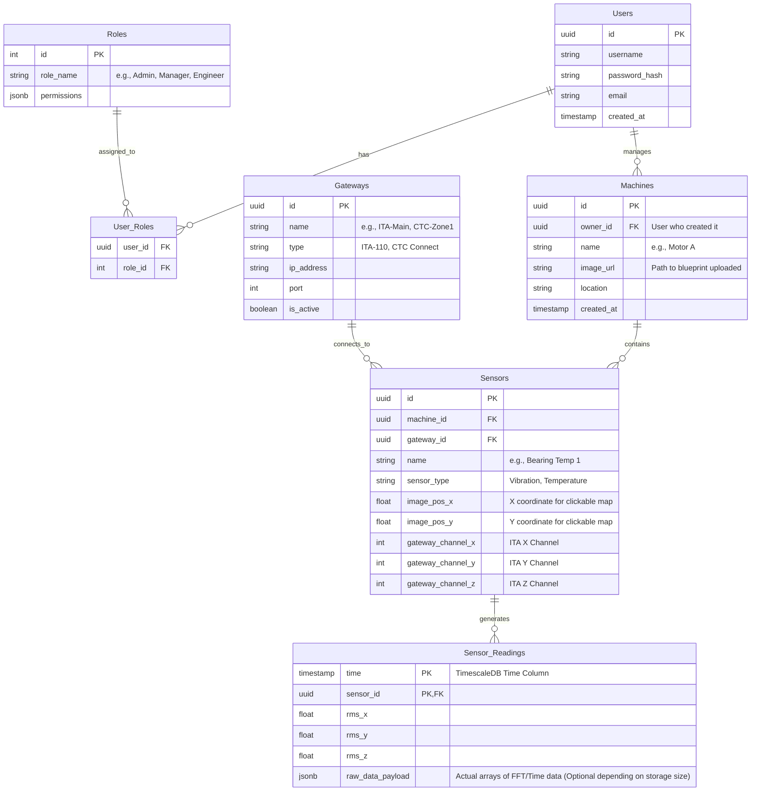

# IIoT PostgreSQL Database Architecture

Below is the recommended Entity-Relationship (ER) schema designed for your IIoT platform. It supports Role-Based Access Control (RBAC), machine image annotations, gateway channel mapping, and high-frequency time-series data.

## Entity-Relationship Diagram

## Core Architectural Pillars

### 1. User Authentication & RBAC (Role-Based Access Control)
Instead of hardcoding users, we separate auth into `Users` and `Roles`.
*   **Users Table**: Never store plain passwords; always use hashes (e.g., `bcrypt`).
*   **Roles Table**: Defines what a user can do. See the main chat response for role definitions.

### 2. Physical Asset Mapping (Machines & Images)
*   **Machines Table**: Stores the machine's name and an `image_url` (path to where the image is stored on your server/bucket).
*   **Sensors Table**: Holds `image_pos_x` and `image_pos_y` to overlay a clickable dot right onto the machine's blueprint on the frontend.

### 3. Gateway & Channel Mapping
*   **Gateways Table**: Stores connection parameters centrally.
*   **Sensors Table**: Since the ITA gateway has multiple channels (up to 16 for X/Y/Z), the `Sensors` table stores exactly which channel mapping this particular sensor relies on.

### 4. TimescaleDB (Time-Series Data)
*   The `Sensor_Readings` table should be configured as a **TimescaleDB Hypertable**.
*   Instead of storing raw 32,000-point arrays for *every* reading (which will explode your database size), calculate metrics (RMS, Peak, Crest Factor) and store those as floats. If you must store the raw array charts, compress them as binary or JSONB, or store them in cheap object storage (AWS S3 / local files) and put the "FilePath" in this database.
